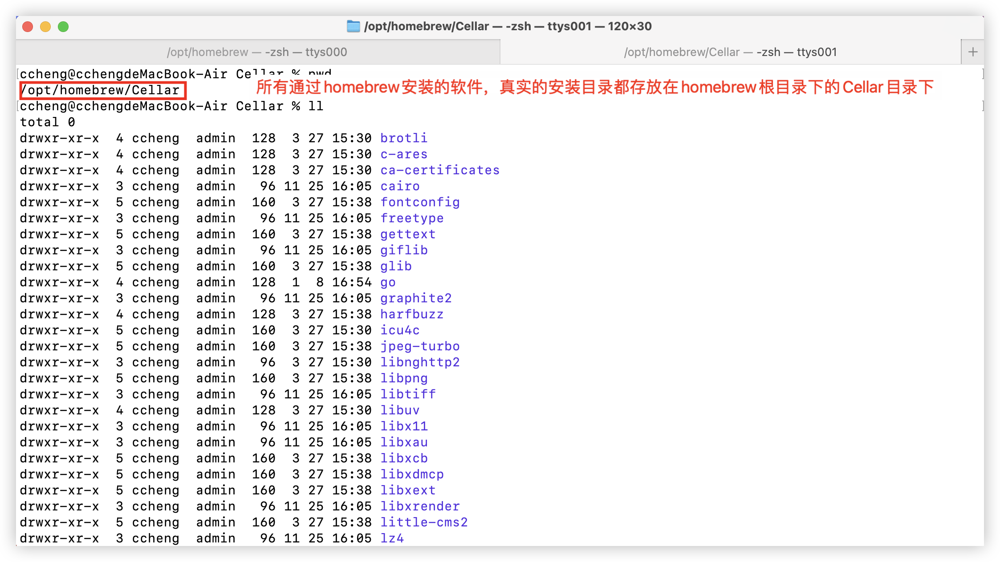
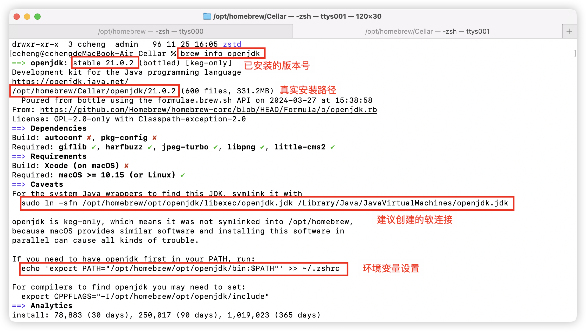
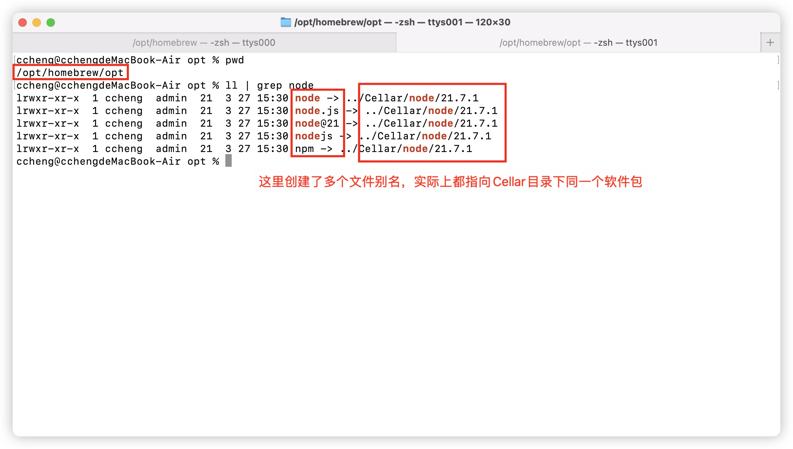
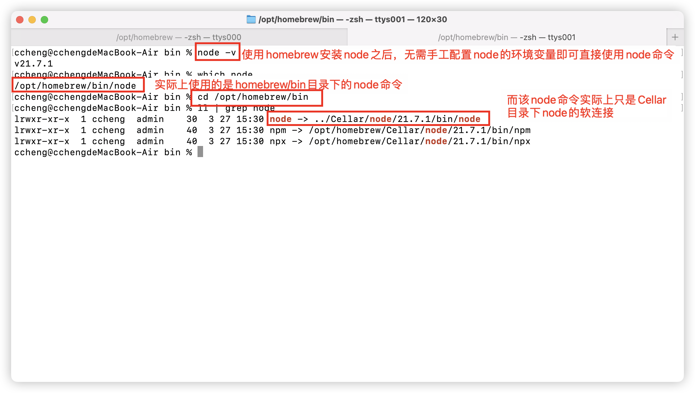
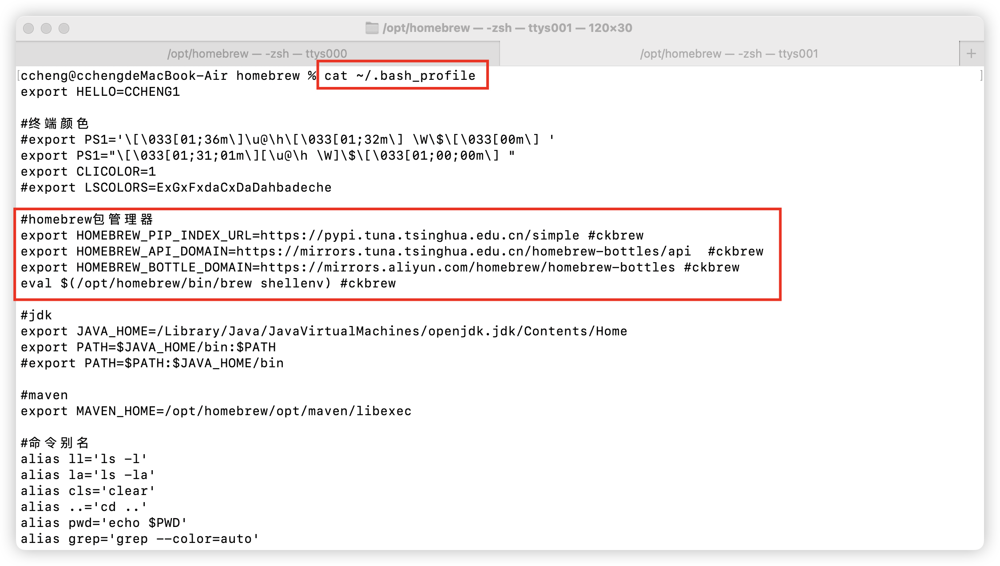

# 关于homebrew
Homebrew 是 macOS 上非常流行的包管理器，它可以帮助用户方便地安装各种开源软件和工具。通过 Homebrew，用户可以通过命令行轻松地安装、更新、卸载各种软件包，极大地简化了 macOS 系统上的软件管理流程。

# homebrew常用命令
1. brew install [package]: 通过此命令安装指定的软件包。 
2. brew uninstall [package]: 卸载已安装的软件包。 
3. brew list: 列出已安装的软件包。 
4. brew update: 更新 HomeBrew 自身及其维护的软件包。 
5. brew upgrade [package]或brew upgrade: 更新已安装的软件包到最新版本。 
6. brew search [keyword]: 搜索软件包。 
7. brew info [package]: 显示软件包的信息。 
8. brew cleanup: 清理旧版本的软件包及缓存文件。

# homebrew自动安装的软件都放哪了
通过homebrew安装的所有软件包，真实的安装目录都在homebrew根目录下的Cellar目录下。
也可以通过brew info [package]命令查询到软件的真实安装路径

# homebrew下opt目录的作用
homebrew安装软件之后会自动在opt目录下生成软件包各种别名的软连接，可能多个别名实际上最终指向Cellar目录下同一个软件包，有时候可以通过不同的别名找到同一个软件包。

# homebrew下bin目录的作用
homebrew安装的部分软件，会自动在bin目录下生成对应的命令的软连接，实际上指向Cellar目录下的软件包命令。
而且由于homebrew本身在安装过程中，已经将/opt/homebrew/bin目录添加到环境变量中了，
所以可以方便一些软件包在安装完成之后无需配置环境变量即可自动使用该命令。

