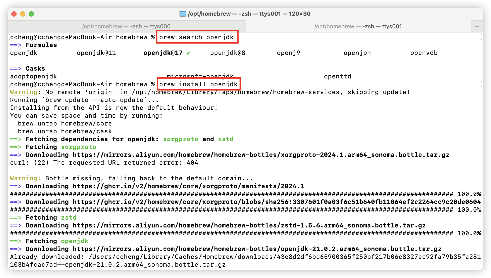

# 基于Homebrew安装openjdk
1. 查询openjdk安装包
```shell
brew search openjdk
```
2. 安装最新版openjdk，也可安装指定版本jdk，目前建议安装17及以上版本，因为SpringBoot3开始要求最低jdk17
```shell
brew install openjdk # 安装最新版jdk，目前是jdk21
brew install openjdk@17 # 安装jdk17
```

3. 查询已安装的jdk的详细信息及建议
```shell
brew info openjdk
```


4. 添加jdk软连接，以便Mac系统可以自动识别已安装的jdk
```shell
sudo ln -sfn /opt/homebrew/opt/openjdk/libexec/openjdk.jdk /Library/Java/JavaVirtualMachines/openjdk.jdk
# /Library/Java/JavaVirtualMachines 是 macOS 上用于存放 Java 虚拟机（JVM）的默认目录。在这个目录下，您可以找到已经安装的不同版本的 Java 运行时环境（JRE）和开发工具包（JDK）。
```
5. 添加jdk环境变量
```shell
# 可以直接使用以下命令将jdk的bin添加到环境变量
echo 'export PATH="/opt/homebrew/opt/openjdk/bin:$PATH"' >> ~/.zshrc
```
但我为了方便管理，以及设置JAVA_HOME，我手工添加到～/.bash_profile

6. 验证目录及版本号是否正确

