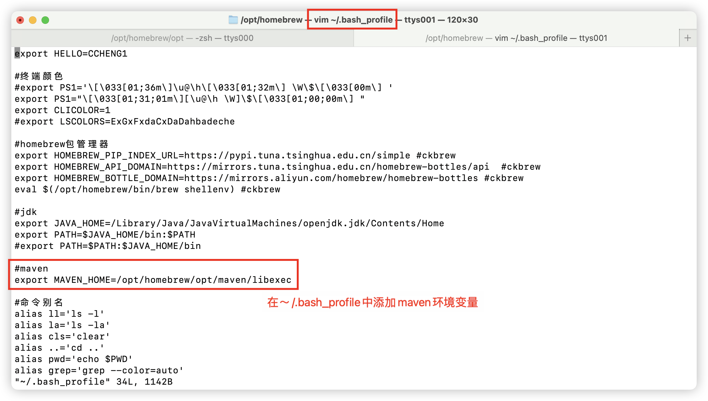

# 基于Homebrew安装maven
1. 查询maven软件包
```shell
brew search maven
```
2. 安装maven软件包
```shell
brew install maven
```

3. 查询已安装的maven的详细信息及建议
```shell
brew info maven
```

4. 配置环境变量

5. 配置settings.xml，添加阿里云国内镜像
```shell
# 从新安装的maven目录复制一份配置文件到～/.m2目录
# .m2 目录是 Maven 的默认存储位置，用于保存本地仓库和 Maven 的配置文件
cp /opt/homebrew/opt/maven/libexec/conf/settings.xml ~/.m2/settings.xml
# 编辑settings.xml，加入阿里云国内镜像
vim ~/.m2/settings.xml
```

