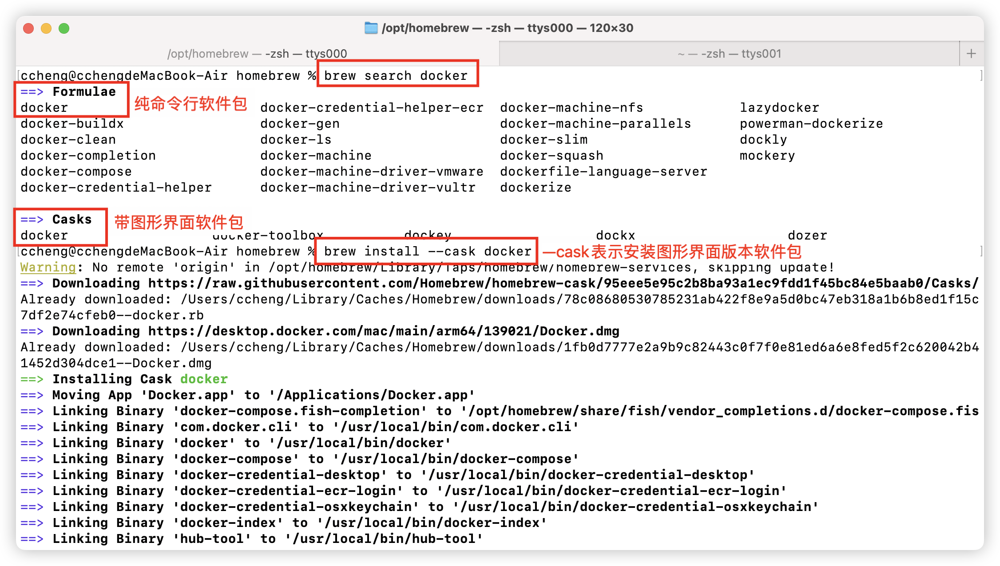
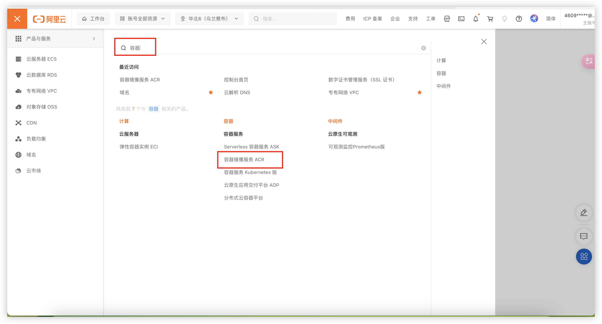
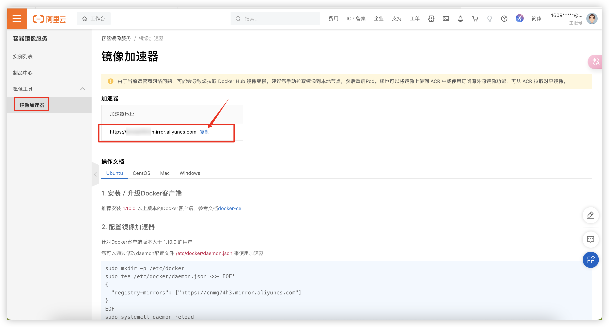
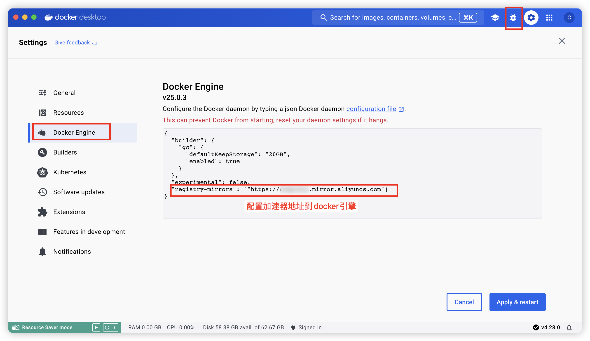
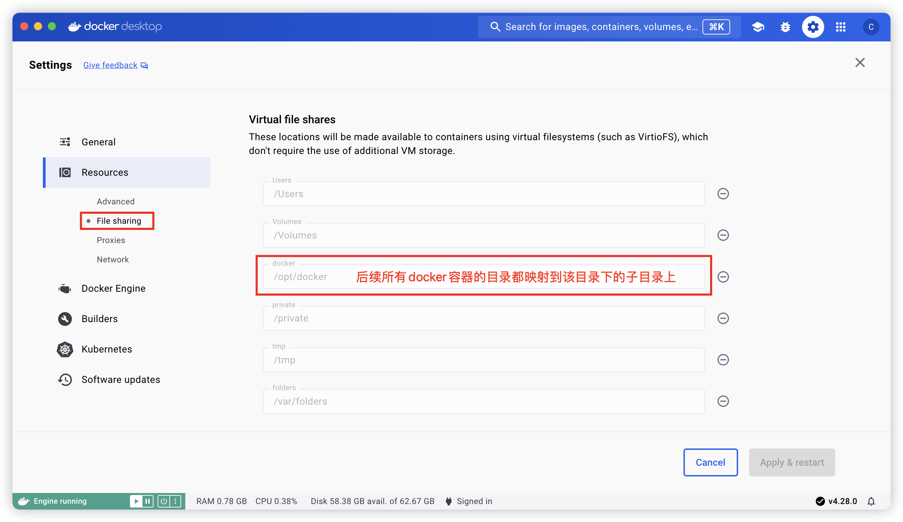

# 基于Homebrew安装docker
1. 查询docker软件包
```shell
brew search docker
```

2. 安装图形化docker软件包
```shell
brew install --cask docker
# 等待安装完成之后，可以在mac启动台看到docker图标，点击即可启动
# 如果以前安装过docker并且卸载不够干净，可能会导致安装失败，比如：It seems there is already a Binary at '/usr/local/bin/com.docker.cli'.
# 此时需要手工把/usr/local/bin/目录下所有Docker相关文件删除掉
```


3. 配置阿里云镜像加速器

登陆自己的阿里云管理后台，复制自己专属的加速器地址




4. 配置共享文件夹

因为docker引擎并非直接运行在MacOS上，而是在Mac上启动了一个Linux虚拟机。
所以对docker容器来说，宿主机其实是Linux虚拟机，容器如果配置了文件夹映射，其实是映射到了Linux虚拟机，而不是映射到MacOS的文件夹上！
为了能够将容器文件夹映射到MacOS上，需要将MacOS文件夹与Linux虚拟机文件夹做一个映射，这个映射就是共享文件夹。
我这里是添加了/opt/docker文件夹的映射，后续所有docker安装的软件，我都映射到/opt/docker文件夹
