# 基于Docker安装MySQL
1. 官方安装手册：
https://hub.docker.com/_/mysql
2. 自定义脚本文件:
[docker-mysql.sh](docker-mysql.sh)
3. 修改脚本文件中的内容，可自定义
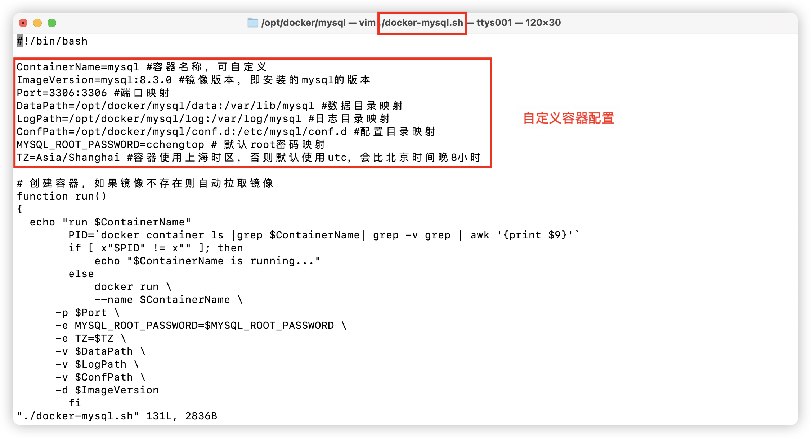
4. 创建自定义安装目录，复制脚本文件到安装目录，并添加可执行权限
```shell
mkdir -p /opt/docker/mysql
cd /opt/docker/mysql
chmod 755 ./docker-mysql.sh
```
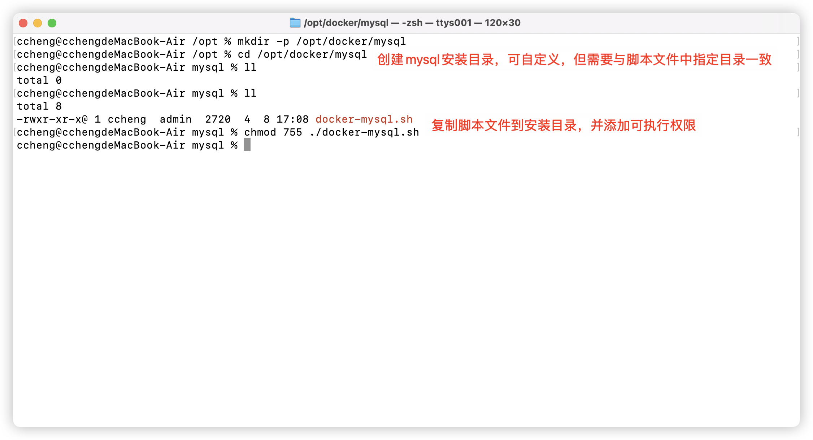
5. 运行脚本文件，创建并启动容器
```shell
./docker-mysql.sh run # 创建并启动容器，如果镜像不存在则自动拉取镜像
./docker-mysql.sh start # 启动已有容器
./docker-mysql.sh stop # 停止容器
./docker-mysql.sh rm # 删除容器
./docker-mysql.sh restart # 重启容器，先stop后start
./docker-mysql.sh status # 查询容器是否正在运行
```
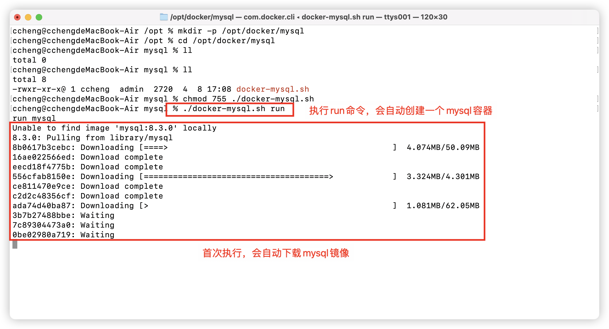
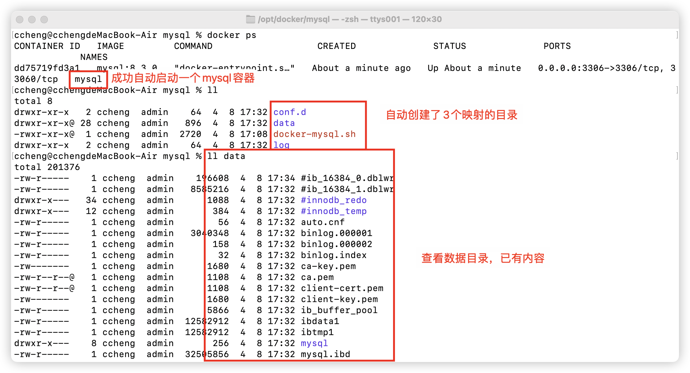
6. 客户端测试能否链接
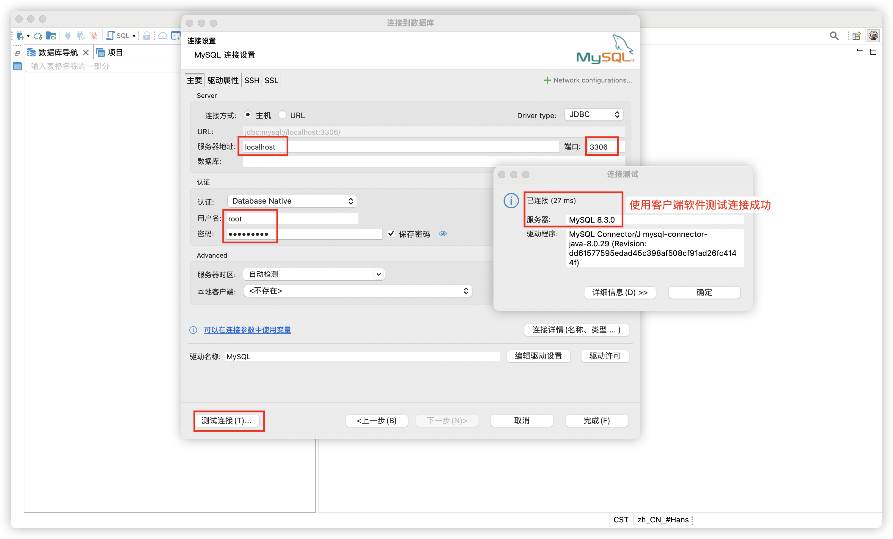
如果出现如下提示
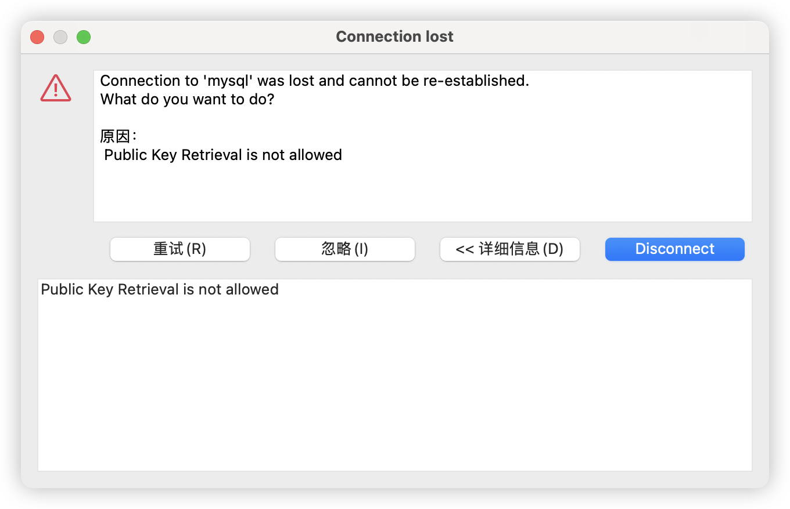
修改链接属性，后重试
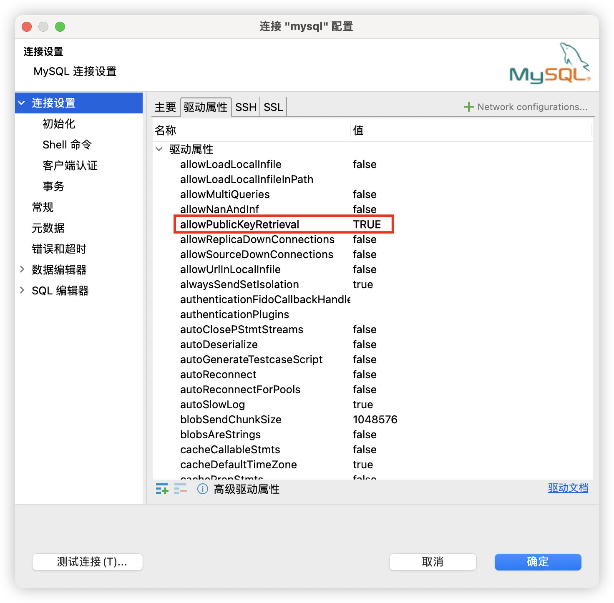
7. 从容器内提取默认的配置文件
```shell
docker cp mysql:/etc/my.cnf /opt/docker/mysql/conf.d
```
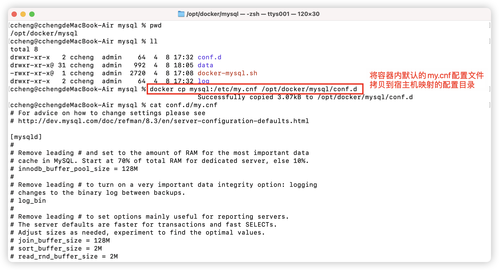
8. 修改配置，可以参考中文注释部分：[my.cnf](./my.cnf) 
> 修改配置文件后，需要重启mysql服务才能生效


# 基于Homebrew安装mysql客户端
1. 安装mysql客户端
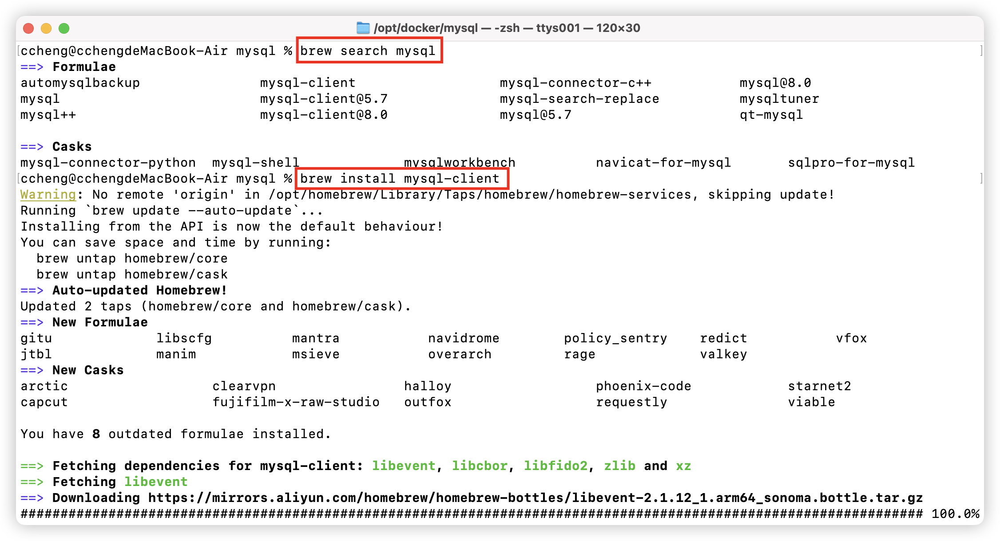
2. 配置环境变量
> 修改环境变量之后，需要使用source命令刷新终端，或者重新开启新的终端，才能生效

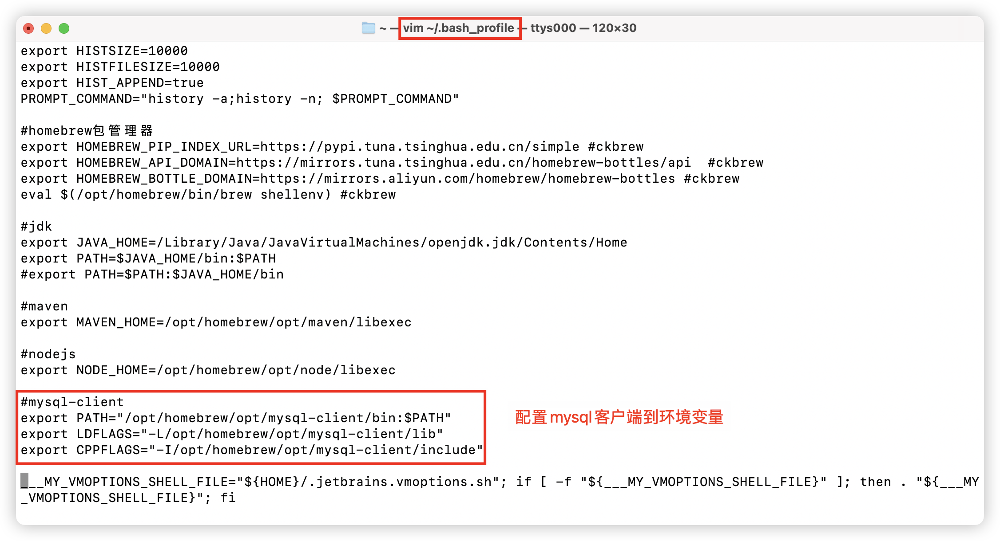
3. 关于宿主机客户端连接mysql容器报错
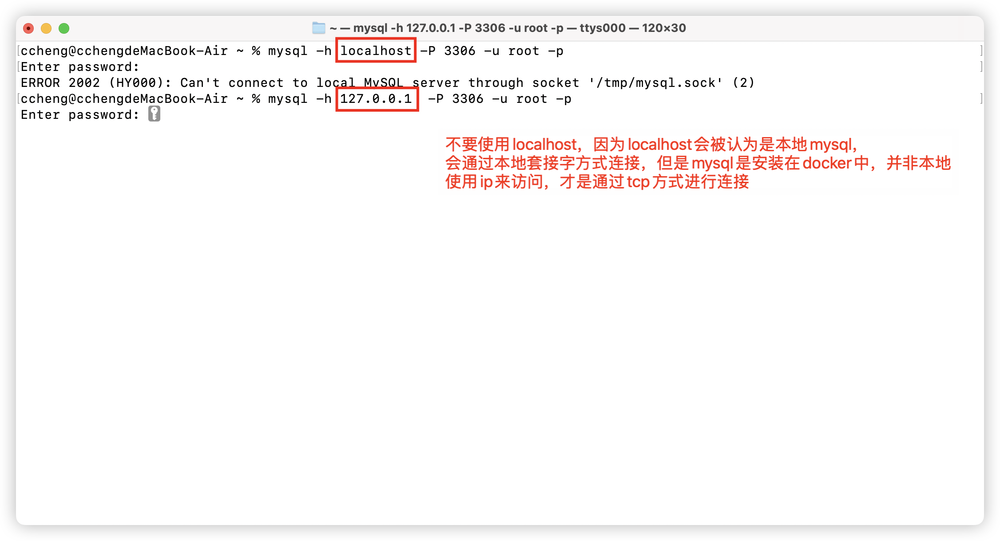
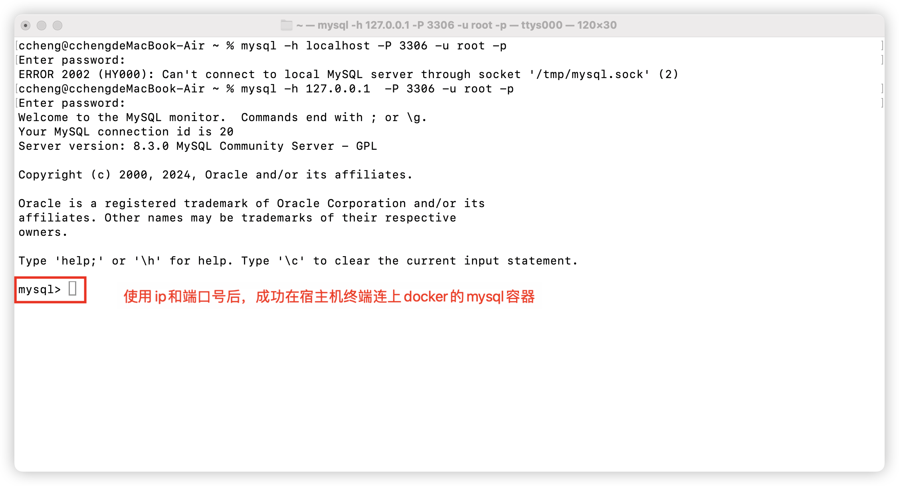
